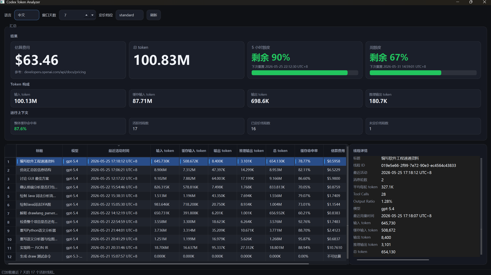

# Codex Token Analyzer

A desktop tool for analyzing token usage, cost, and rate limits of [OpenAI Codex CLI](https://github.com/openai/codex) sessions.

English | [中文](#codex-token-analyzer-1)

## Features

- **Token usage breakdown** — input, cached input, output, and reasoning tokens per thread and in aggregate
- **Cost estimation** — configurable per-model pricing with optional regional uplift
- **Rate limit tracking** — 5-hour and weekly quota usage with color-coded progress bars
- **Dark-themed GUI** — sortable thread table, KPI cards, and detailed per-thread inspector panel
- **Bilingual** — Chinese (中文) / English interface with timezone-aware timestamps
- **CLI mode** — JSON-style text report for scripting and terminal use
- **Portable EXE** — standalone Windows executable, no Python installation needed

## Screenshots



## Installation

### Option 1: Download EXE (Recommended)

Download the latest `CodexTokenAnalyzer.exe` from the [Releases](https://github.com/CMD137/codex_token_analyzer/releases) page. Double-click to run — no installation required.

> **Note:** The EXE reads session data from `~/.codex/`, so Codex CLI must be installed and have a history of sessions.

### Option 2: Run from Source

Requirements: **Python 3.10+**

```bash
git clone https://github.com/CMD137/codex_token_analyzer.git
cd codex_token_analyzer
pip install -r requirements.txt
python codex_token_analyzer.py --gui
```

## Usage

### GUI Mode

Launch the app (EXE or `python codex_token_analyzer.py --gui`):

- **Time window** — filter threads active within the last N days
- **Language** — switch between Chinese and English
- **Pricing profile** — select a pricing profile from `pricing_config.json`
- **Refresh** — manually reload session data

Click any thread in the table to inspect its detailed breakdown.

### CLI Mode

```
python codex_token_analyzer.py [options]
```

| Flag | Description | Default |
|------|-------------|---------|
| `--days N` | Lookback window in days | `7` |
| `--lang zh\|en` | Language / timezone | `en` |
| `--pricing-config PATH` | Custom pricing config file | `pricing_config.json` |
| `--pricing-profile NAME` | Pricing profile to use | Profile from config |
| `--regional` | Enable regional pricing uplift | disabled |
| `--gui` | Launch the GUI | — |

Example:

```bash
# Chinese report, last 30 days, with regional pricing
python codex_token_analyzer.py --lang zh --days 30 --regional

# Launch GUI
python codex_token_analyzer.py --gui
```

## Configuration

### `pricing_config.json`

Define model pricing and aliases:

```json
{
  "default_profile": "standard",
  "profiles": {
    "standard": {
      "gpt-5.5": {
        "input_per_million": 5.0,
        "cached_input_per_million": 0.5,
        "output_per_million": 30.0,
        "regional_uplift_percent": 10.0
      }
    }
  },
  "model_aliases": {
    "gpt-5.1": "gpt-5.5"
  }
}
```

- **`input_per_million`** — cost per 1M input tokens (USD)
- **`cached_input_per_million`** — cost per 1M cached input tokens, or `null` to charge full price
- **`output_per_million`** — cost per 1M output tokens (USD)
- **`regional_uplift_percent`** — percentage added to subtotal for regional pricing
- **`model_aliases`** — maps model identifiers found in session data to pricing entries

Pricing reference: [OpenAI API Pricing](https://openai.com/api/pricing/)

## Data Sources

The analyzer reads from the local Codex data directory (`~/.codex/`):

| Source | Content |
|--------|---------|
| `sessions/**/*.jsonl` | Session event logs with token usage |
| `session_index.jsonl` | Thread metadata (title, last activity) |
| `state_5.sqlite` | Fallback thread titles |
| `logs_2.sqlite` | Rate limit WebSocket events |

**No data is uploaded or sent anywhere.** All analysis happens locally.

## Build from Source

Build a standalone Windows EXE:

```bash
pip install pyinstaller
pyinstaller CodexTokenAnalyzer.spec
```

The output will be at `dist/CodexTokenAnalyzer.exe`.

## Project Structure

```
codex_token_analyzer/
├── codex_token_analyzer.py      # Entry point, CLI, language config
├── codex_token_analyzer_gui.py  # PySide6 GUI
├── analyzer_core.py             # Session parsing & report generation
├── pricing.py                   # Cost estimation engine
├── pricing_config.json          # Model pricing profiles
├── CodexTokenAnalyzer.spec      # PyInstaller spec
├── requirements.txt             # Python dependencies
├── main_window.png              # Screenshot
└── README.md
```

## License

MIT

---

# Codex Token Analyzer

一款用于分析 [OpenAI Codex CLI](https://github.com/openai/codex) 会话 Token 用量、费用和速率限制的桌面工具。

[English](#codex-token-analyzer) | 中文

## 功能

- **Token 用量明细** — 每个对话的输入、缓存输入、输出和推理 Token 统计
- **费用估算** — 可配置的按模型定价，支持区域溢价
- **速率限制追踪** — 5小时/每周配额用量，彩色进度条提示
- **深色主题 GUI** — 可排序对话表格、KPI 卡片、详情面板
- **双语界面** — 中文/英文切换，时区感知的时间戳
- **命令行模式** — 终端文本报告，适合脚本调用
- **便携 EXE** — 独立可执行文件，无需安装 Python

## 截图


## 安装

### 方式一：下载 EXE（推荐）

从 [Releases](https://github.com/CMD137/codex_token_analyzer/releases) 页面下载最新的 `CodexTokenAnalyzer.exe`，双击运行即可。

> **注意：** EXE 会读取 `~/.codex/` 中的会话数据，需确保已安装 Codex CLI 并有使用记录。

### 方式二：从源码运行

环境要求：**Python 3.10+**

```bash
git clone https://github.com/CMD137/codex_token_analyzer.git
cd codex_token_analyzer
pip install -r requirements.txt
python codex_token_analyzer.py --gui
```

## 使用说明

### GUI 模式

启动应用（EXE 或 `python codex_token_analyzer.py --gui`）：

- **时间窗口** — 筛选最近 N 天内有活动的对话
- **语言** — 中英文界面切换
- **定价方案** — 从 `pricing_config.json` 中选择定价配置
- **刷新** — 手动重新加载会话数据

点击表格中的任意对话可查看详细分解。

### CLI 模式

```
python codex_token_analyzer.py [选项]
```

| 选项 | 说明 | 默认值 |
|------|------|--------|
| `--days N` | 统计最近 N 天 | `7` |
| `--lang zh\|en` | 语言/时区 | `en` |
| `--pricing-config PATH` | 自定义定价配置文件 | `pricing_config.json` |
| `--pricing-profile NAME` | 使用的定价方案 | 配置文件中的默认方案 |
| `--regional` | 启用区域定价溢价 | 禁用 |
| `--gui` | 启动图形界面 | — |

示例：

```bash
# 中文报告，最近 30 天，启用区域定价
python codex_token_analyzer.py --lang zh --days 30 --regional

# 启动 GUI
python codex_token_analyzer.py --gui
```

## 配置说明

### `pricing_config.json`

定义模型定价和别名映射：

```json
{
  "default_profile": "standard",
  "profiles": {
    "standard": {
      "gpt-5.5": {
        "input_per_million": 5.0,
        "cached_input_per_million": 0.5,
        "output_per_million": 30.0,
        "regional_uplift_percent": 10.0
      }
    }
  },
  "model_aliases": {
    "gpt-5.1": "gpt-5.5"
  }
}
```

- **`input_per_million`** — 每百万输入 Token 费用（美元）
- **`cached_input_per_million`** — 每百万缓存输入 Token 费用，设为 `null` 表示按原价计费
- **`output_per_million`** — 每百万输出 Token 费用（美元）
- **`regional_uplift_percent`** — 区域溢价百分比
- **`model_aliases`** — 将会话数据中的模型标识映射到定价条目

定价参考：[OpenAI API Pricing](https://openai.com/api/pricing/)

## 数据来源

分析器读取本地 Codex 数据目录（`~/.codex/`）：

| 来源 | 内容 |
|------|------|
| `sessions/**/*.jsonl` | 会话事件日志及 Token 用量 |
| `session_index.jsonl` | 对话元数据（标题、最后活动时间） |
| `state_5.sqlite` | 备用的对话标题 |
| `logs_2.sqlite` | 速率限制 WebSocket 事件 |

**不会上传或发送任何数据。** 所有分析均在本地完成。

## 从源码打包

构建独立的 Windows EXE：

```bash
pip install pyinstaller
pyinstaller CodexTokenAnalyzer.spec
```

生成的 EXE 位于 `dist/CodexTokenAnalyzer.exe`。

## 项目结构

```
codex_token_analyzer/
├── codex_token_analyzer.py      # 入口、CLI、语言配置
├── codex_token_analyzer_gui.py  # PySide6 图形界面
├── analyzer_core.py             # 会话解析与报告生成
├── pricing.py                   # 费用估算引擎
├── pricing_config.json          # 模型定价配置
├── CodexTokenAnalyzer.spec      # PyInstaller 打包配置
├── requirements.txt             # Python 依赖
├── main_window.png              # 截图
└── README.md
```

## 许可证

MIT
